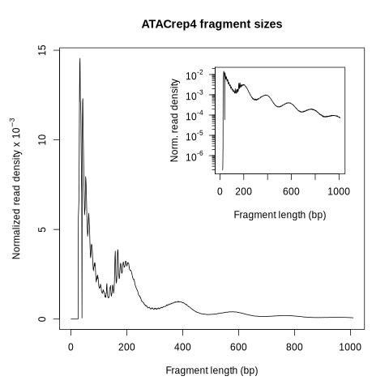
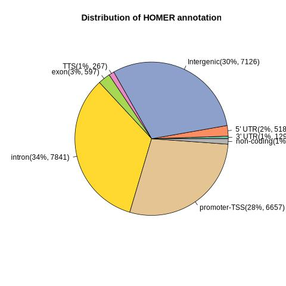
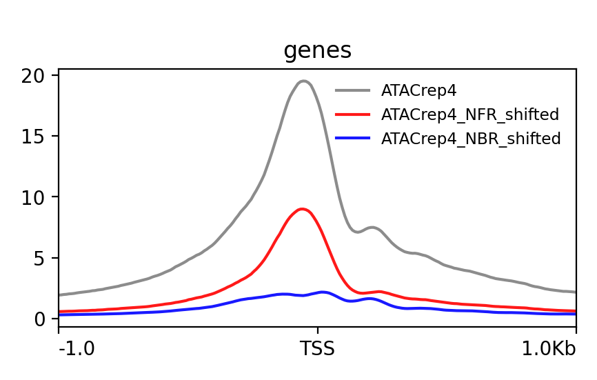
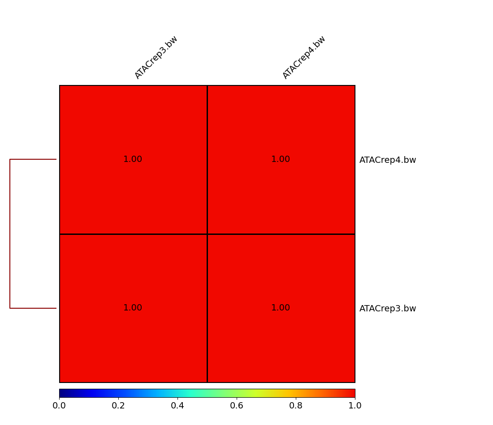
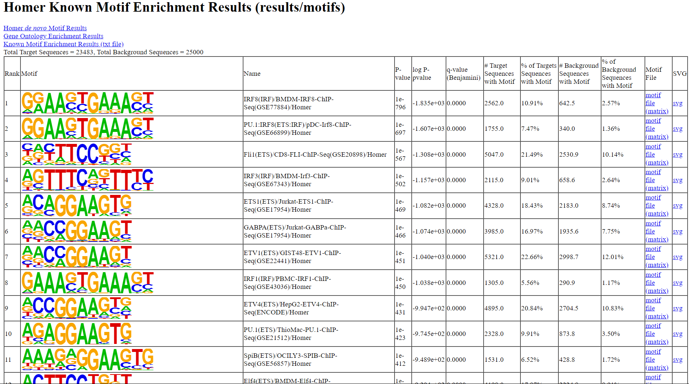
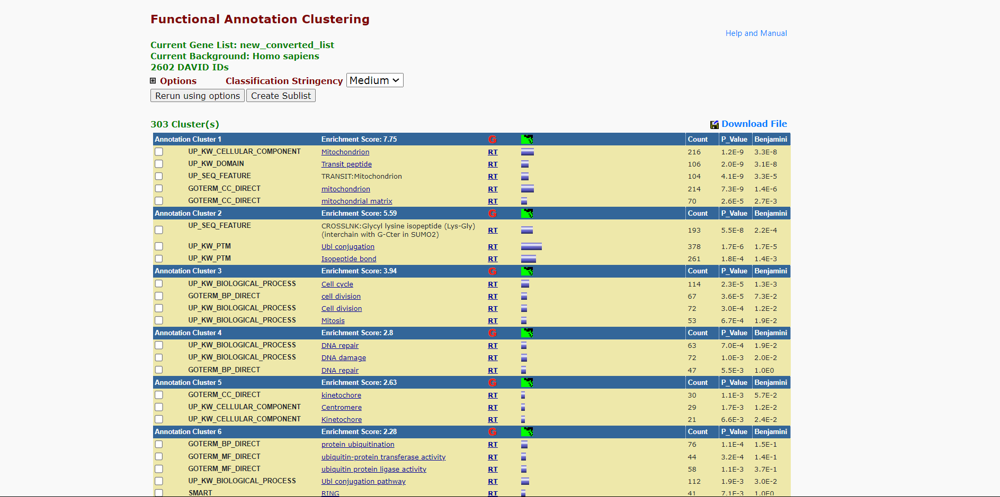

ATACSeq
================
2024-04-25

## Methods:

Snakemake (version 8.5.2) \[
[1](https://doi.org/10.12688/f1000research.29032.1) \] was used to
develop the entire pipeline with the steps mentioned below:

1.  Quality control:
    - Raw sequencing reads obtained from the experimental samples were
      subjected to quality control (QC) analysis using FastQC (version
      0.12.1-0) \[
      [2](http://www.bioinformatics.babraham.ac.uk/projects/fastqc/) \]
      to assess the overall sequencing quality, identify overrepresented
      sequences, and detect potential adapter contamination.
2.  Adapter trimming:
    - Trimming of adapter sequences and low-quality bases was performed
      using Trimmomatic (version 0.39) \[
      [3](https://www.ncbi.nlm.nih.gov/pmc/articles/PMC4103590/) \] with
      default parameters.
    - Since the data is paired end, Trimmomatic was run in PE mode and
      the Nextera-PE adapters fasta file from Trimmomatic was passed.
3.  Alignment:
    - Trimmed reads were aligned to the reference genome using Bowtie2
      (version 2.5.3) \[
      [4](https://www.ncbi.nlm.nih.gov/pmc/articles/PMC3322381/) \] with
      the parameter “-X 2000” to accommodate for larger insert sizes.
    - Following alignment, reads mapping to the mitochondrial chromosome
      were removed using SAMtools (version 1.19.2) \[
      [5](https://doi.org/10.1093/bioinformatics/btp352) \] with the
      view option and using awk to remove “chrM” matches.
4.  Correction for tagmentation bias:
    - To correct for bias introduced during the tagmentation process,
      aligned reads were shifted using alignmentSieve from deepTools
      (version 3.5.4) \[
      [6](https://academic.oup.com/nar/article/44/W1/W160/2499308) \] on
      default settings.
    - Additionally to isolate the nucleosome free regions (NFR) and
      nucleosome bound regions (NBR), minimum and maximum fragment
      lengths were passed (0-100 and 180-247 respectively). These were
      saved as separate bams for visualisation purposes.
5.  Quality control analysis using ATACseqQC:
    - Fragment size distribution profiles were generated for each sample
      using ATACseqQC (version 1.26.0) \[
      [7](https://doi.org/10.1186/s12864-018-4559-3) \].
    - This tool provided insights into the distribution of DNA fragment
      sizes, allowing assessment of the efficiency of the ATAC-seq
      library preparation process.
6.  Peak calling:
    - Peak calling was performed using MACS3 (Model-based Analysis of
      ChIP-Seq version 3, version 3.0.1) \[
      [8](https://doi.org/10.1186/gb-2008-9-9-r137) \] with default
      parameters optimised for ATAC-seq data analysis.
    - Peaks were called independently for each replicate sample.
7.  Peak reproducibility and blacklisted region filtering:
    - To ensure the reproducibility of identified peaks across
      replicates a peak filtering strategy was employed. Bedtools
      (version 2.31.1) \[
      [9](https://doi.org/10.1093/bioinformatics/btq033) \] was used to
      intersect peak regions from individual replicates and generate a
      single set of reproducible peaks. -f option was set to 0.5 for a
      more stringent intersection.
    - These reproducible peaks were further filtered to exclude any
      regions overlapping with known blacklisted genomic regions from
      ENCODE for hg38 to minimise false-positive signals.
8.  Annotating Peaks:
    - The filtered peaks were annotated with their nearest genomic
      features using the annotatePeaks.pl from HOMER (version 4.11) \[
      [10](https://pubmed.ncbi.nlm.nih.gov/20513432/) \]. The annotation
      provides valuable information about the genomic context of the
      peaks.
    - annotatePeaks was run on default parameters. The output is a
      single txt file with all the desired annotation information which
      will be used for further downstream processing like creating a pie
      chart to study the distribution of different regions in the file.
9.  Motif finding:
    - Motif finding was performed on list of filtered peaks to identify
      enriched motifs using the findMotifsGenome.pl from HOMER \[
      [10](https://pubmed.ncbi.nlm.nih.gov/20513432/) \].
    - This analysis helps in understanding the potential binding
      sequences enriched in the peak regions. findMotifsGenome was run
      on default parameters. The output is a directory containing
      multiple files of interest, but mainly a html containing the known
      motifs of interest.
10. Signal Coverage Analysis:
    - Matrix Generation: The computeMatrix utility from DeepTools \[
      [6](https://academic.oup.com/nar/article/44/W1/W160/2499308) \]
      was employed to calculate scores/counts from the bigWig files
      falling into specified gene regions provided in the BED file (
      from UCSC table browser). This was done in the reference-point
      mode twice, once for each replicate of the sample, to generate
      matrices of values representing signal coverage across gene
      bodies. The bams containing the NFR and NBR information were also
      converted to bigwig for visualisation.
    - computeMatrix was run on default settings with an additional 1kb
      upstream and downstream of the TSS (reference-point). Additionally
      the bigwigs for NFR and NBR were also passed.
    - The blacklist region files was passed again to remove background
      enrichment for a clearer image.
    - Plotting matrix: Following the computation of matrices, the
      plotProfile utility from DeepTools was used to generate
      visualisations of the signal coverage averaged across the body of
      all genes in the reference genome, and also the NFR and NBR
      regions for each replicate by using the –perGroup option.
    - This utility allows for the creation of line plots depicting the
      average signal intensity. plotProfile was run using default
      settings and run twice, once for each matrix replicate generated
      in the previous step.
11. Gene enrichment analysis:
    - Peak annotation was performed to associate identified peaks with
      nearby genes. Enrichment analysis of these genes was conducted
      using the online tool DAVID (version Dec.2021 v2023q4) \[
      [11](https://pubmed.ncbi.nlm.nih.gov/35325185/) \] to uncover
      biological pathways and functions influenced by chromatin
      accessibility changes. Only the top 3000 genes were passed since
      that is the limit that DAVID can accomodate.
    - This analysis provided insights into the regulatory elements and
      target genes affected by the observed epigenetic alterations.

## Discussion:

1.  Briefly remark on the quality of the sequencing reads and the
    alignment statistics, make sure to specifically mention the
    following:

- Are there any concerning aspects of the quality control of your
  sequencing reads?
- Are there any concerning aspects of the quality control related to
  alignment?
- Based on all of your quality control, will you exclude any samples
  from further analysis?

<!-- -->

    Ans:

    No. Based on the metrics obtained from FastQC, samtools flagstats and ATACseqQC, the data passes the quality threshold for all the required modules and all samples can be used for further downstream processing.

2.  After alignment, quickly calculate how many alignments were
    generated from each sample in total and how many alignments were
    against the mitochondrial chromosome

- Report the total number of alignments per sample
- Report the number of alignments against the mitochondrial genome

Ans:

<table>
<tr>
<th>
Sample
</th>
<th>
Number of alignments
</th>
<th>
Number of alignments retained post filtering
</th>
<th>
Number of mitochondiral alignments
</th>
</tr>
<tr>
<td>
ATACrep3
</td>
<td>
163727140
</td>
<td>
41947071
</td>
<td>
121780069
</td>
</tr>
<tr>
<td>
ATACrep4
</td>
<td>
122822726
</td>
<td>
32024398
</td>
<td>
90798328
</td>
</tr>
</table>

<br><br>

3.  After performing peak calling analysis, generating a set of
    reproducible peaks and filtering peaks from blacklisted regions,
    please answer the following:

- How many peaks are present in each of the replicates?
- How many peaks are present in your set of reproducible peaks? What
  strategy did you use to determine “reproducible” peaks?
- How many peaks remain after filtering out peaks overlapping
  blacklisted regions?

Ans:

<table>
<tr>
<th>
Sample
</th>
<th>
Number of peaks
</th>
</tr>
<tr>
<td>
ATACrep3
</td>
<td>
46293
</td>
</tr>
<tr>
<td>
ATACrep4
</td>
<td>
37481
</td>
</tr>
<tr>
<td>
Reproducible peak
</td>
<td>
24076
</td>
</tr>
<tr>
<td>
After filtering blacklisted regions
</td>
<td>
23486
</td>
</tr>
</table>

<br>

4.  After performing motif analysis and gene enrichment on the peak
    annotations, please answer the following:

- Briefly discuss the main results of both of these analyses
- What can chromatin accessibility let us infer biologically?

<!-- -->

    Ans:

    The cells used in the experiment are derived from human B-lymphocytes which are involved in immune response and antibody production. Motif analysis shows transcription factors such as IRF8 and PU.1 which are highly relevant, as they play key roles in B-cell development and function. Fli1, a member of the ETS family, is associated with hematopoiesis and regulation of B-cell differentiation. IRF3 is involved in innate immune responses, potentially reflecting cell activation. ETS1 and GABPA motifs are also relevant due to their roles in B-cell development and function. 

    The gene enrichment analysis using DAVID shows that the cells display heightened transcriptional activity in genes related to essential cellular processes. The enrichment of genes associated with mitochondrial function suggests increased energy metabolism, possibly to sustain the high proliferative rate typical of lymphoblastoid cells. Furthermore, the enrichment of genes involved in protein modification and cell cycle regulation suggests active protein turnover and cell cycle progression, reflecting the dynamic nature of these cells.

    Chromatin accessibility reflects the degree of DNA accessibility to regulatory proteins, crucial for gene expression. Techniques like ATAC-seq capture open chromatin regions, indicating active regulatory sites. Differential accessibility between cell types or conditions reveals regulatory landscapes underlying differentiation, disease mechanisms, and response to stimuli, offering insights into transcription factor binding and epigenetic regulation.

## Plots

ATACSeq rep3 Fragment Size Distribution plot generated using ATACseqQC:

``` r
knitr::include_graphics("results/ATACrep3.fragment.size.distribution.jpeg")
```


ATACSeq rep4 Fragment Size Distribution plot generated using ATACseqQC:

``` r
knitr::include_graphics("results/ATACrep4.fragment.size.distribution.jpeg")
```



Pie chart of region distribution in HOMER annotated output file:

``` r
knitr::include_graphics("results/annotated_piechart.jpeg")
```



Signal coverage of ATACSeq rep3 sample:

``` r
knitr::include_graphics("results/ATACrep3_coverage_plot.png")
```


Signal coverage of ATACSeq rep4 sample:

``` r
knitr::include_graphics("results/ATACrep4_coverage_plot.png")
```



Pearson correlation plot between rep3 and rep4 sample:

``` r
knitr::include_graphics("results/correlation_plot.png")
```



HOMER Motif output:

``` r
knitr::include_graphics("results/HOMER_motif.png")
```



GSEA performed on top 3000 genes from HOMER annotated file:

``` r
knitr::include_graphics("results/functional_annotation_clustering.png")
```



### Citations:

1.  [Snakemake](https://doi.org/10.12688/f1000research.29032.1):
    - Mölder, F., Jablonski, K.P., Letcher, B., Hall, M.B.,
      Tomkins-Tinch, C.H., Sochat, V., Forster, J., Lee, S., Twardziok,
      S.O., Kanitz, A., Wilm, A., Holtgrewe, M., Rahmann, S., Nahnsen,
      S., Köster, J., 2021. Sustainable data analysis with Snakemake.
      F1000Res 10, 33.
2.  [FastQC](http://www.bioinformatics.babraham.ac.uk/projects/fastqc/):
    - Andrews, S. (2010). FastQC: A Quality Control Tool for High
      Throughput Sequence Data Online.
3.  [Trimmomatic](https://www.ncbi.nlm.nih.gov/pmc/articles/PMC4103590/):
    - Bolger AM, Lohse M, Usadel B. Trimmomatic: a flexible trimmer for
      Illumina sequence data. Bioinformatics. 2014 Aug 1;30(15):2114-20.
      doi: 10.1093/bioinformatics/btu170. Epub 2014 Apr 1. PMID:
      24695404; PMCID: PMC4103590.
4.  [Bowtie2](https://www.ncbi.nlm.nih.gov/pmc/articles/PMC3322381/):
    - Langmead B, Salzberg SL. Fast gapped-read alignment with Bowtie 2.
      Nat Methods. 2012 Mar 4;9(4):357-9. doi: 10.1038/nmeth.1923. PMID:
      22388286; PMCID: PMC3322381.
5.  [Samtools](https://doi.org/10.1093/bioinformatics/btp352):
    - Heng Li, Bob Handsaker, Alec Wysoker, Tim Fennell, Jue Ruan, Nils
      Homer, Gabor Marth, Goncalo Abecasis, Richard Durbin, 1000 Genome
      Project Data Processing Subgroup, The Sequence Alignment/Map
      format and SAMtools, Bioinformatics, Volume 25, Issue 16, August
      2009, Pages 2078–2079.
6.  [DeepTools](https://academic.oup.com/nar/article/44/W1/W160/2499308):
    - Ramírez, Fidel, Devon P. Ryan, Björn Grüning, Vivek Bhardwaj,
      Fabian Kilpert, Andreas S. Richter, Steffen Heyne, Friederike
      Dündar, and Thomas Manke. deepTools2: A next Generation Web Server
      for Deep-Sequencing Data Analysis. Nucleic Acids Research (2016).
7.  [ATACseqQC](https://doi.org/10.1186/s12864-018-4559-3):
    - Ou J, Liu H, Yu J, Kelliher MA, Castilla LH, Lawson ND, Zhu LJ
      (2018). “ATACseqQC: a Bioconductor package for post-alignment
      quality assessment of ATAC-seq data.” BMC Genomics, 19(1), 169.
      ISSN 1471-2164, <doi:10.1186/s12864-018-4559-3>.
8.  [MACS3](https://doi.org/10.1186/gb-2008-9-9-r137):
    - Zhang, Y., Liu, T., Meyer, C.A. et al. Model-based Analysis of
      ChIP-Seq (MACS). Genome Biol 9, R137 (2008).
9.  [Bedtools](https://doi.org/10.1093/bioinformatics/btq033):
    - Aaron R. Quinlan, Ira M. Hall, BEDTools: a flexible suite of
      utilities for comparing genomic features, Bioinformatics, Volume
      26, Issue 6, March 2010, Pages 841–842.
10. [HOMER](https://pubmed.ncbi.nlm.nih.gov/20513432/):
    - Heinz S, Benner C, Spann N, Bertolino E et al. Simple Combinations
      of Lineage-Determining Transcription Factors Prime cis-Regulatory
      Elements Required for Macrophage and B Cell Identities. Mol Cell
      2010 May 28;38(4):576-589. PMID: 20513432
11. [DAVID](https://pubmed.ncbi.nlm.nih.gov/35325185/):
    - B.T. Sherman, M. Hao, J. Qiu, X. Jiao, M.W. Baseler, H.C. Lane, T.
      Imamichi and W. Chang. DAVID: a web server for functional
      enrichment analysis and functional annotation of gene lists (2021
      update). Nucleic Acids Research. 23 March 2022.
      <doi:10.1093/nar/gkac194>.
