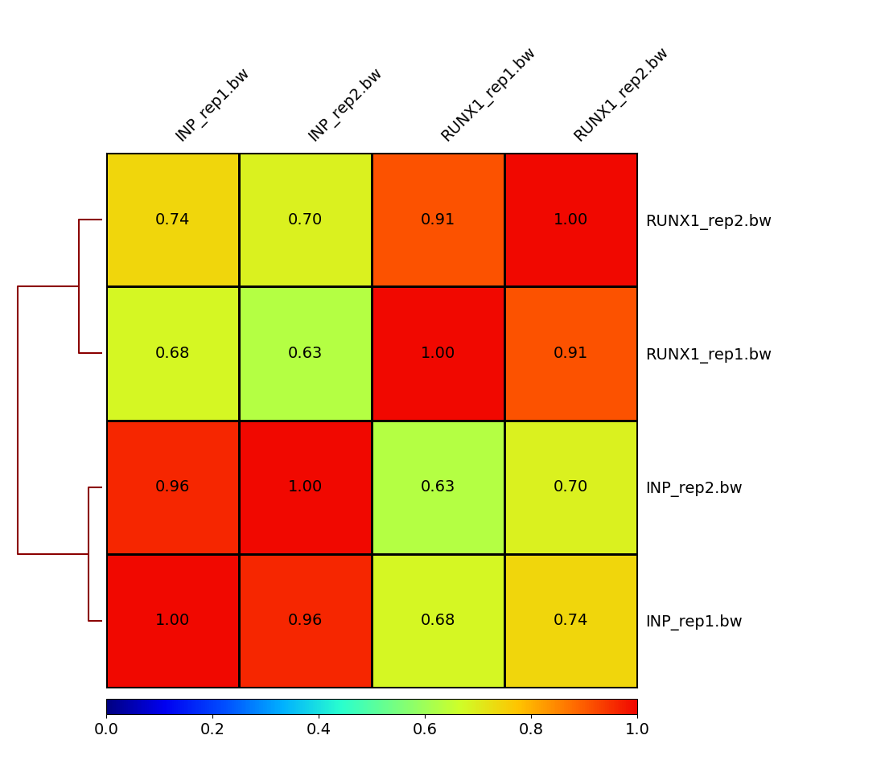
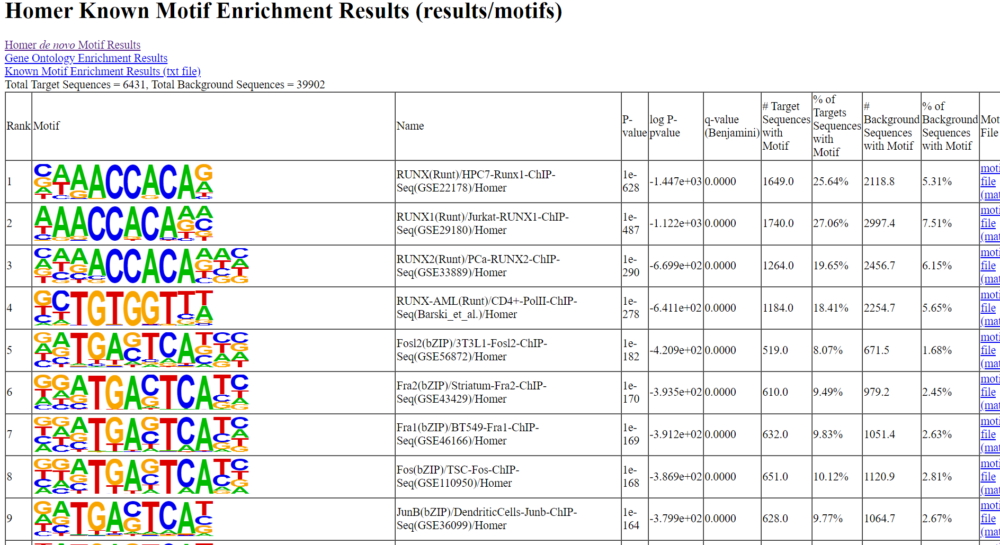
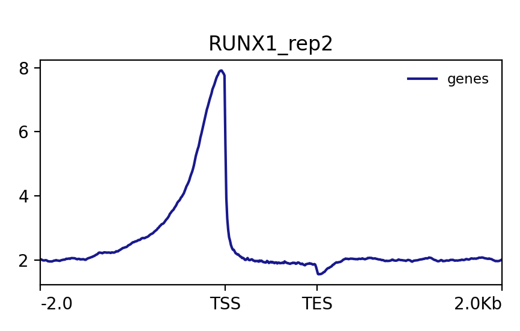

Method:
1. Downloading Fastq files:
- The metadata of the required files was saved in a csv file ("sample_sheet.csv") which had the columns of interest (name of the sample, replicate information, SRR ID, ftp link for download, etc). All the data is publically available on EMBL-ENA (https://www.ebi.ac.uk/ena/browser/view/PRJNA302327)
- This information was used to download the files via the ftp link using "wget" method and renamed for ease of understanding (based on the condition/replicate/timepoint information) using lambda expressions.

2. Quality metrics using FastQC:
- FastQC (version 0.12.1-0) was used to obtain quality information on each read. Default parameters were used while running the tool
- Metrics such as per-base sequence quality, sequence length distribution, and overrepresented sequences, etc were obtained.

3. Index generation using Bowtie2:
- Default parameters were used for Bowtie2-build (version 2.5.3) to build the index.
- Bowtie2 used the human reference genome to produce a series of output files representing the index.

4. Trimming using Trimmomatic:
- Adapter trimming was done using Trimmomatic (version 0.39) on the fastq files.
- The single end adapter file was provided and used for adapter removal.
- Default parameters for single end reads were used (which includes ILLUMINACLIP adapter trimming, LEADING and TRAILING quality filtering, and SLIDINGWINDOW trimming for quality control). 

5. Alignment of reads using Bowtie2:

- Raw sequencing reads were aligned to the human reference genome using Bowtie2 (version 2.5.3) aligner software.
- The Bowtie2 aligner was executed with default parameters, and the alignment was done using the index previously generated for the human reference genome (also formed using Bowtie2).
- The SAM output from Bowtie2 was piped directly to samtools (version 1.19.2) for conversion into the compressed BAM.

6. Sorting of aligned BAM files:

- Aligned BAM files were sorted using samtools (version 1.19.2).
- The sorting process rearranges alignments within each BAM file according to their genomic coordinates.

7. Indexing of sorted BAM files:

- Sorted BAM files were then processed to generate corresponding bam index files. Samtools was used in default settings.
- The index files allow fast retrieval of alignment information from specific genomic regions.

8. Quality assessment with samtools flagstat:

- Samtools flagstat was used to assess quality of alignment on default settings.

9. Aggregation of quality control outputs:

- Multiqc (version 1.20) was used to aggregate quality control outputs from multiple sources into a single comprehensive report.
- Outputs from samtools flagstat and fastqc were gathered and compiled using MultiQC on default parameters.

10. Generation of bigwig files from BAMs:

- Aligned BAM files were converted into bigwig format which is used for visualisation and quantitative analysis of read coverage using Deeptools (version 3.5.4) on default settings.
- Bigwig files represent the genome divided into bins of equal size.

11. Summary matrix with MultiBigwigSummary:

- To summarise quantitative information from bigwig files multiBigwigSummary from Deeptools was used on default.
- This utility aggregated read coverage data from all bigwig files into a single matrix which allows for comparative analysis.

12. Pearson Correlation with PlotCorrelation:

- Pearson correlation analysis was performed to assess the similarity of read coverage patterns between samples.
- The plotCorrelation tool from Deeptools was used to generate a clustered heatmap displaying Pearson correlation values between all pairs of samples.

13. Generating Tag Directories
- Tag directories were generated for each sample bam using the makeTagDirectory from HOMER (version 4.11). This is since HOMER needs the input information to be in HOMER-specific format which the sorted bam files are not in.
- The sorted BAM files were taken as input and a corresponding tag directory was produced by running makeTagDirectory on default parameters.

14. Peak Calling
- Peak calling was performed using findPeaks from HOMER on each set of paired replicates (rep1 and rep2). 
- findPeaks uses the corresponding tag directories generated in the previous step. Peak calling was performed on default parameters by taking one sample as experiment and the other as control, and the output were 2 peak files (for rep1 and rep2).

15. Converting Peak Files to BED Format
- The output peak files generated by HOMER cannot be used in further downstream analysis, so they have to be converted to BED format using pos2bed from HOMER. 
- pos2bed was run on default parameters and 2 bed files were obtained (rep1 and rep2).

16. Determining Reproducible Peaks
- The 2 bed files generated in the previous step (rep1 and rep2) were used to find the overlapping peaks by intersecting the peak sets using Bedtools (version 2.31.1).
- Bedtools intersect was run on default parameters and the output was a single bed file which had the reproducible peaks from both the replicates. A minimum overlap of 50% was added by specifying 0.5 in the -f flag while running bedtools intersect. -r flag was also added to make this minimum overlap a reciprocal requirement (ie, both peaks should overlap by 50%).

17. Filtering Blacklisted Regions
- To eliminate potential noise and signal artifacts, the reproducible peaks falling within blacklisted genomic regions were filtered. 
- Bedtools intersect was used again with a blacklist file containing known problematic regions. The filtered output was stored in a new bed file for further processing.

18. Annotating Peaks to Genomic Features
- The filtered peaks were annotated with their nearest genomic features using the annotatePeaks.pl from HOMER. The annotation provides valuable information about the genomic context of the peaks. 
- annotatePeaks was run on default parameters, except the GTF file used was a custom one and not the default GTF provided by HOMER. Custom GRCh38 genome was passed as well so that the transcript IDs map accurately. The output is a single txt file with all the desired information.

19. Motif Finding
- Motif finding was performed on the list of filtered peaks to identify enriched motifs using the findMotifsGenome.pl from HOMER. 
- This analysis helps in understanding the potential binding sequences enriched in the peak regions. findMotifsGenome was run on default parameters except the genome that was passed was the custom GRCh38 genome and not the default one used by HOMER. The output is a directory containing multiple files of interest, but mainly a html containing the motifs of interest


20. Data Retrieval and Preprocessing:

- BigWig Files: Peak calling and motif analysis were performed on ChIP-seq data to identify enriched regions of RUNX1 binding. The bigWig files representing the signal intensity across the genome were generated for all 4 samples.
- Gene Annotation: To plot signal coverage across gene bodies, genomic coordinates of all genes in the hg38 reference genome are required. These were obtained using the UCSC table browser, where a BED file listing the transcription start site (TSS) and transcription termination site (TTS) locations for every gene in the reference genome was extracted using GRCh38 reference genome and leaving all the UCSC table browser parameters on default. Snakemake workflow was used to execute this.
- RNAseq Data: Differential expression results from the RNAseq experiment were retrieved from the  accession GSE75070. Specifically, the DESeq2 results (GSE75070_MCF7_shRUNX1_shNS_RNAseq_log2_foldchange.txt.gz) was downloaded for further analysis.

21. Signal Coverage Analysis:

- Matrix Generation: The computeMatrix utility from DeepTools was employed to calculate scores/counts from the bigWig files falling into specified gene regions provided in the BED file (hg38_genes.bed from UCSC table browser). This was done in the scale-regions mode twice, once for each replicate of the IP (RUNX1) sample, to generate matrices of values representing RUNX1 signal coverage across gene bodies. computeMatrix was run on default settings with an additional 2kb upstream and downstream of the TSS and TTS. Snakemake workflow was used to execute this by defining a computeMatrix rule.
- Plotting matrix: Following the computation of matrices, the plotProfile utility from DeepTools was used to generate visualisations of the RUNX1 signal coverage averaged across the body of all genes in the reference genome (GRCh38). This utility allows for the creation of line plots depicting the average signal intensity. plotProfile was run using default settings and run twice, once for each matrix replicate generated in the previous step. Snakemake workflow was used to execute this by defining a plotProfile rule.

22. Integration with RNAseq Results:
- Data Filtering: The DESeq2 results obtained from the RNAseq experiment were subjected to the same filters and cutoffs as specified in the methods of the original paper. This included applying thresholds for significance (padj) lesser than 0.01 as significant and fold change >1 as significant to identify differentially expressed (DE) genes. There were 1153 DE genes after filtering.
- Recreation of figures: Using the list of DE genes and the annotated peak file generated previously, figures from the original paper were recreated. Stacked bar charts were produced to show the proportions of DE genes with a RUNX1 peak found within specified distances from the TSS by comparing the bound genes (within cutoff distance of 5kb, 20kb and 100kb) with the unbound genes and plotting the percentage of bound genes on Y-axis while the X-axis had 2 bars (upregulated and downregulated) for each distance cutoff.

23. Visualisation BigWig files using IGV:

- IGV Setup: To visualise peaks in the promoter regions of specific genes, the bigWig files for samples were used, the BED file of reproducible peaks, and the primary assembly GTF file containing annotations for the reference genome were loaded in IGV (2.17.2).
- Visualisation: The promoter regions of key genes reported in the paper, such as MALAT1 and NEAT1, were inspected in the genome browser. Signal coverage from bigWig files and peak locations from the BED file were visualised to compare with figures from the paper and and while the general trend of peaks were similar (such as peaks being captured in the promoter region), not all peaks found in the paper were visible in the bigwig files.

Results:
                                                     
1. Correlation Plot                                                     
```{r, correlation heatmap from plotCorrelation}

```

2. Motifs Found                                                     
```{r, motif results from findMotifsGenome}

```              

3. Signal Coverage of RUNX1 rep2 sample                                                     
```{r, signal coverage plots from plotProfile}

```        

4. Visualising peaks in NEAT1 gene region using IGV
```{r, NEAT1  genome browser view with tracks}
knitr::include_graphics("/images/NEAT1_SCC.png")
```                

Conclusion:
The results vary significantly from the original paper and this is due to a few reasons:
- The tool versions have changed since the paper published their findings. The way the tool performs it's functions would vary significantly due to the version difference.
- The version of the reference genome has changed (we used GRCh38)
- The authors were not explicit with their methodology and did not specify potential steps done to retain relevant results. We ran tools on default settings while the authors were not explicit for every time what settings were used while running different tools.                                                     
